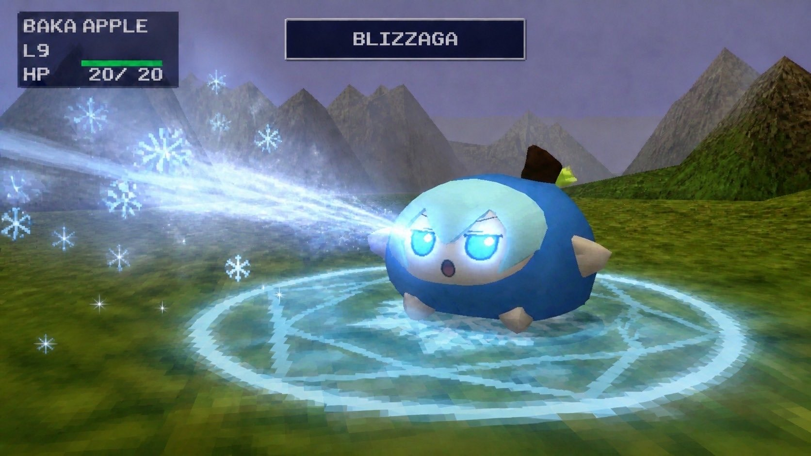
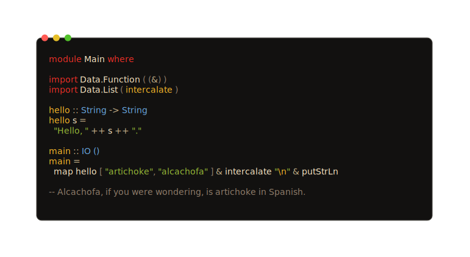
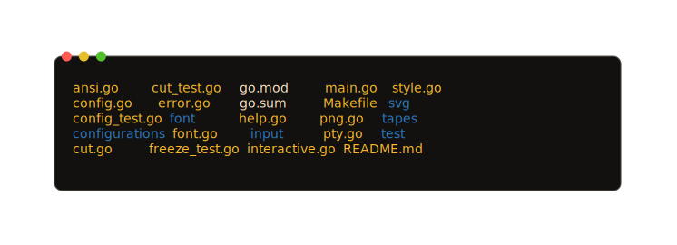
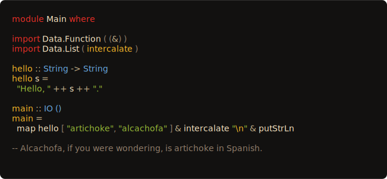
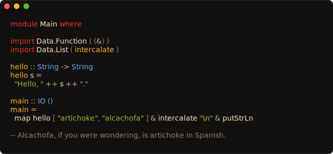
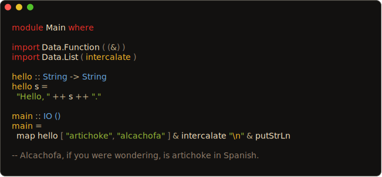
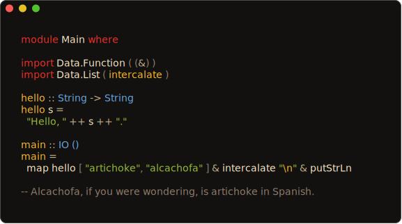
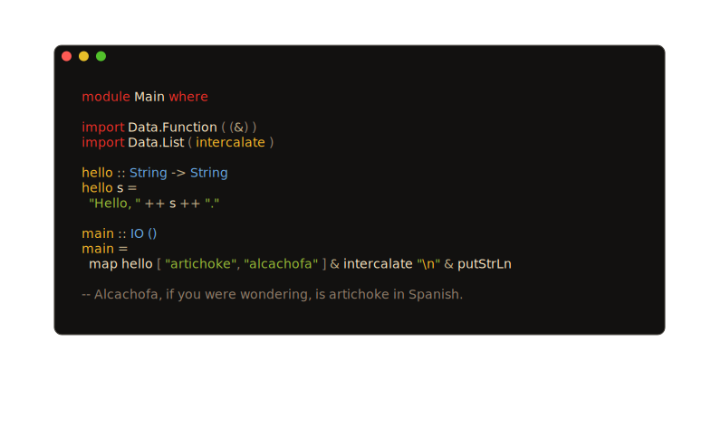
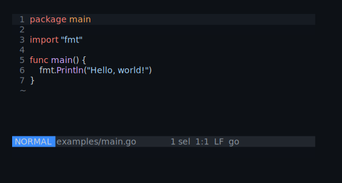

# Blizzaga

<p> <br> </p>

Generate images of code and terminal output.

This fork of [freeze](https://github.com/charmbracelet/freeze) adds the
[`srcery`](https://srcery.sh/) theme and sets it as the default.

## Examples

Blizzaga generates PNGs, SVGs, and WebPs of code and terminal output alike.

### Generate an image of code

```sh
blizzaga artichoke.hs -o artichoke.png
```

<p align="center">

</p>

### Generate an image of terminal output

You can use `blizzaga` to capture ANSI output of a terminal command with the `--execute` flag.

```bash
blizzaga --execute "eza -lah"
```

<p align="center">
 </p>

Blizzaga is also [super customizable](#customization) and ships with an
[interactive TUI](#interactive-mode).

## Installation

Install with Go:

```sh
go install github.com/starbaser/blizzaga@latest
```

Run with Nix:

```sh
nix run github:starbaser/blizzaga
```

From a local checkout:

```sh
nix run '.#'
go run .
```

## Customization

### Interactive mode

Blizzaga features a fully interactive mode for easy customization.

```bash
blizzaga --interactive
```


Settings are written to `$XDG_CONFIG/blizzaga/user.json` and can be accessed with
`blizzaga --config user`.

### Flags

Screenshots can be customized with `--flags` or [Configuration](#configuration) files.

> [!NOTE]
> You can view all blizzaga customization with `blizzaga --help`.

- [`-b`](#background), [`--background`](#background): Apply a background fill.
- [`-c`](#configuration), [`--config`](#configuration): Base configuration file or template.
- [`-l`](#language), [`--language`](#language): Language to apply to code
- [`-m`](#margin), [`--margin`](#margin): Apply margin to the window.
- [`-o`](#output), [`--output`](#output): Output location for .svg, .png, .jpg.
- [`-p`](#padding), [`--padding`](#padding): Apply padding to the code.
- [`-r`](#border-radius), [`--border.radius`](#border-radius): Corner radius of window.
- [`-t`](#theme), [`--theme`](#theme): Theme to use for syntax highlighting.
- [`-w`](#window), [`--window`](#window): Display window controls.
- [`-H`](#height), [`--height`](#height): Height of terminal window.
- [`--border.width`](#border-width): Border width thickness.
- [`--border.color`](#border-width): Border color.
- [`--shadow.blur`](#shadow): Shadow Gaussian Blur.
- [`--shadow.x`](#shadow): Shadow offset x coordinate.
- [`--shadow.y`](#shadow): Shadow offset y coordinate.
- [`--font.family`](#font): Font family to use for code.
- [`--font.ligatures`](#font): Use ligatures in the font.
- [`--font.size`](#font): Font size to use for code.
- [`--font.file`](#font): File path to the font to use (embedded in the SVG).
- [`--line-height`](#font): Line height relative to font size.
- [`--show-line-numbers`](#line-numbers): Show line numbers.
- [`--lines`](#line-numbers): Lines to capture (start,end).

### Language

If possible, `blizzaga` auto-detects the language from the file name or analyzing the file contents.
Override this inference with the `--language` flag.

```bash
cat artichoke.hs | blizzaga --language haskell
```

<br />


### Theme

The default theme is `srcery`. Change the color theme with `--theme`; the original `charm` theme
remains available.

```bash
blizzaga artichoke.hs --theme srcery
```

<br />


### Output

Change the output file location, defaults to `out.svg` or stdout if piped.
This value supports `.svg`, `.png`, `.webp`.

```bash
blizzaga main.go --output out.svg
blizzaga main.go --output out.png
blizzaga main.go --output out.webp

# or all of the above
blizzaga main.go --output out.{svg,png,webp}
```

### Font

Specify the font family, font size, and font line height of the output image.
Defaults to `JetBrains Mono`, `14`(px), `1.2`(em).

```bash
blizzaga artichoke.hs \
  --font.family "SF Mono" \
  --font.size 16 \
  --line-height 1.4
```

You can also embed a font file (in TTF, WOFF, or WOFF2 format) using the `--font.file` flag.

To use ligatures in the font, you can apply the `--font.ligatures` flag.

### Line Numbers

Show line numbers in the terminal window with the `--show-line-numbers` flag.

```bash
blizzaga artichoke.hs --show-line-numbers
```

To capture only a specific range of line numbers you can use the `--lines` flag.

```bash
blizzaga artichoke.hs --show-line-numbers --lines 2,3
```

### Border Radius

Add rounded corners to the terminal.

```bash
blizzaga artichoke.hs --border.radius 8
```

<br />



### Window

Add window controls to the terminal, macOS-style.

```bash
blizzaga artichoke.hs --window
```



### Background

Set the background color of the terminal window.

```bash
blizzaga artichoke.hs --background "#121110"
```

### Height

Set the height of the terminal window.

```bash
blizzaga artichoke.hs --height 400
```

### Border Width

Add a border outline to the terminal window.

```bash
blizzaga artichoke.hs --border.width 1 --border.color "#515151" --border.radius 8
```

<br />



### Padding

Add padding to the terminal window.
You can provide 1, 2, or 4 values.

```bash
blizzaga main.go --padding 20          # all sides
blizzaga main.go --padding 20,40       # vertical, horizontal
blizzaga main.go --padding 20,60,20,40 # top, right, bottom, left
```

<br />



### Margin

Add margin to the terminal window.
You can provide 1, 2, or 4 values.

```bash
blizzaga main.go --margin 20          # all sides
blizzaga main.go --margin 20,40       # vertical, horizontal
blizzaga main.go --margin 20,60,20,40 # top, right, bottom, left
```

<br />



### Shadow

Add a shadow under the terminal window.

```bash
blizzaga artichoke.hs --shadow.blur 20 --shadow.x 0 --shadow.y 10
```

<br />


## Screenshot TUIs

Use `tmux capture-pane` to generate screenshots of TUIs.

Run your TUI in `tmux` and get it to the state you want to capture.
Next, use `capture-pane` to capture the pane and pipe that to blizzaga.

```bash
hx # in a separate pane
tmux capture-pane -pet 1 | blizzaga -c full
```



## Configuration

Blizzaga also supports configuration via a JSON file which can be passed with the `--config` / `-c`
flag. In general, all `--flag` options map directly to keys and values in the config file

There are also some default configurations built into `blizzaga` which can be passed by name.

- `base`: Simple screenshot of code.
- `full`: macOS-like screenshot.
- `user`: Uses `~/.config/blizzaga/user.json`.

If you use `--interactive` mode, a configuration file will be created for you at
`~/.config/blizzaga/user.json`. This will be the default configuration file used in your
screenshots.

```bash
blizzaga -c base main.go
blizzaga -c full main.go
blizzaga -c user main.go # alias for ~/.config/blizzaga/user.json
blizzaga -c ./custom.json main.go
```

Here’s what an example configuration looks like:

```json
{
  "window": false,
  "theme": "srcery",
  "background": "#121110",
  "border": {
    "radius": 0,
    "width": 0,
    "color": "#504D47"
  },
  "shadow": false,
  "padding": [20, 40, 20, 20],
  "margin": "0",
  "font": {
    "family": "JetBrains Mono",
    "size": 14
  },
  "line_height": 1.2
}
```

## Contributing

See [contributing][contribute].

[contribute]: https://github.com/starbaser/blizzaga/contribute

## Feedback

Open issues and pull requests on [GitHub](https://github.com/starbaser/blizzaga).

## License

[MIT](https://github.com/starbaser/blizzaga/raw/main/LICENSE)
